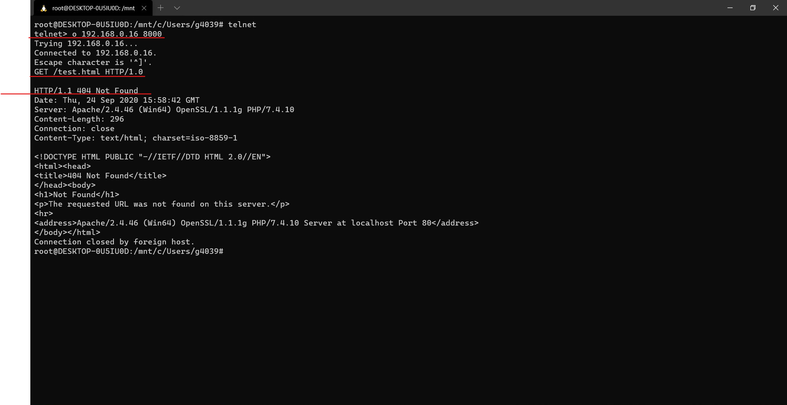

# Книжный магазин

**Вариант 11**

*Книжный магазин: авторы, книги, продавцы, покупатели, регистрация продаж.*

**Выполнили**
* [Медведев Д. А., студент группы ПМИм-191](https://github.com/MedvedevDenis)
* [Найденко А. В., студент группы ПМИм-191](https://github.com/AndreyNaidenko)

## Use-cases

Ниже приведены основные сценарии использования сайта:

1. При нажатии кнопки "Каталог" на любой из страниц открывается список категорий книг. 
2. При выборе категории "Все книги" в "Каталоге" открывается список всех книг.
3. При выборе книги "Агата Кристи. Десять негритят" открывается подробная информация о книге.

## Сетки страниц

### Главная страница

<iframe style="border: 1px solid rgba(0, 0, 0, 0.1);" width="800" height="450" src="https://www.figma.com/embed?embed_host=share&url=https%3A%2F%2Fwww.figma.com%2Ffile%2FW7G5HRGOIMFjztg6a4tz3D%2F%25D0%259A%25D0%25BD%25D0%25B8%25D0%25B6%25D0%25BD%25D1%258B%25D0%25B9-%25D0%25BC%25D0%25B0%25D0%25B3%25D0%25B0%25D0%25B7%25D0%25B8%25D0%25BD%3Fnode-id%3D9%253A7&chrome=DOCUMENTATION" allowfullscreen></iframe>

### Каталог
<iframe style="border: 1px solid rgba(0, 0, 0, 0.1);" width="800" height="450" src="https://www.figma.com/embed?embed_host=share&url=https%3A%2F%2Fwww.figma.com%2Ffile%2FW7G5HRGOIMFjztg6a4tz3D%2F%25D0%259A%25D0%25BD%25D0%25B8%25D0%25B6%25D0%25BD%25D1%258B%25D0%25B9-%25D0%25BC%25D0%25B0%25D0%25B3%25D0%25B0%25D0%25B7%25D0%25B8%25D0%25BD%3Fnode-id%3D0%253A1&chrome=DOCUMENTATION" allowfullscreen></iframe>

### Отдельная страница
<iframe style="border: 1px solid rgba(0, 0, 0, 0.1);" width="800" height="450" src="https://www.figma.com/embed?embed_host=share&url=https%3A%2F%2Fwww.figma.com%2Ffile%2FW7G5HRGOIMFjztg6a4tz3D%2F%25D0%259A%25D0%25BD%25D0%25B8%25D0%25B6%25D0%25BD%25D1%258B%25D0%25B9-%25D0%25BC%25D0%25B0%25D0%25B3%25D0%25B0%25D0%25B7%25D0%25B8%25D0%25BD%3Fnode-id%3D26%253A89&chrome=DOCUMENTATION" allowfullscreen></iframe>

## Сборка страниц на bootstrap

Ознакомиться с результатами верстки можно по [ссылке](html/).

## Скриншоты как у вас в браузере ваши страницы открываются, скриншоты страниц верстки в протоколе

## Скриншоты работы в telnet

## Заголовки каждой страницы через HEAD, проверить статус ответа

## Содержимое каждой страницы через GET, проверить статус ответа

## Заголовок и содержимое несуществующей страницы, например /any_page.html

## Попробовать отправить POST-запрос на главную страницу

