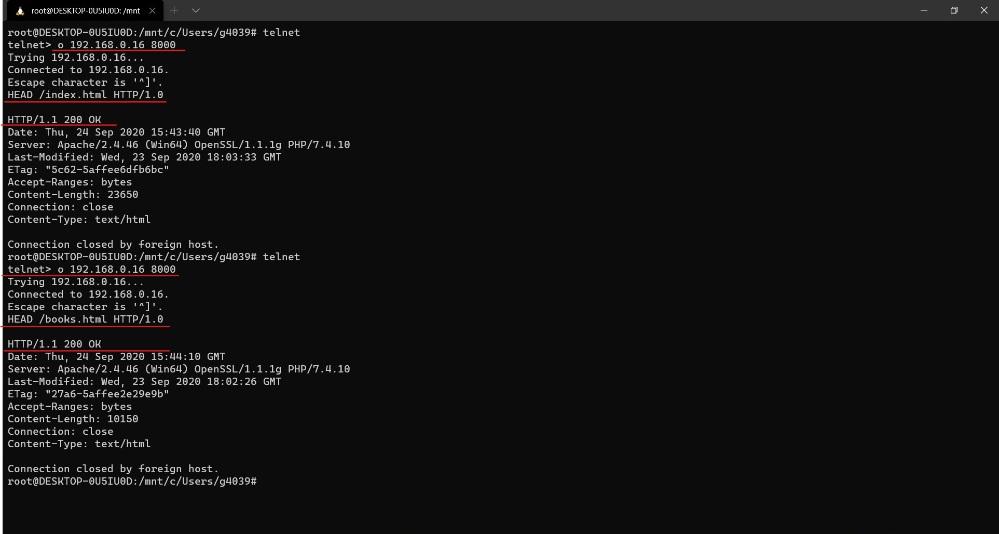
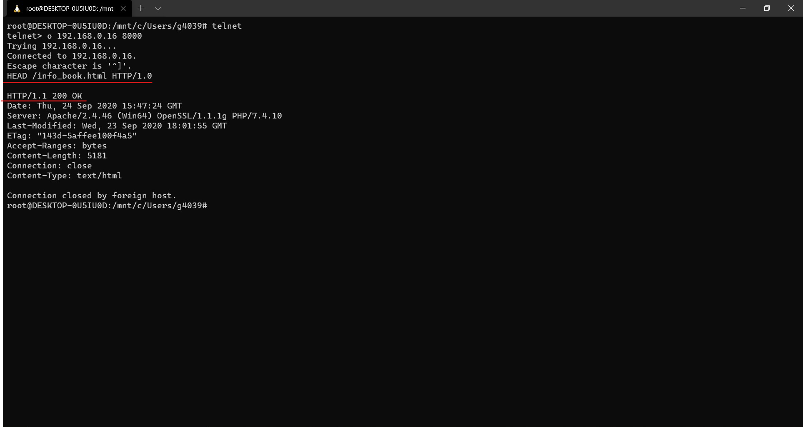
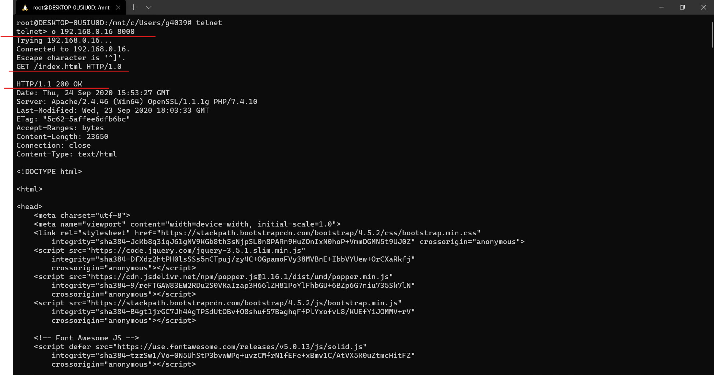
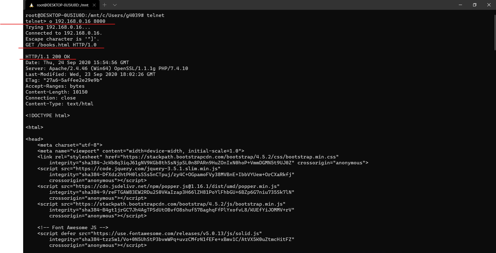
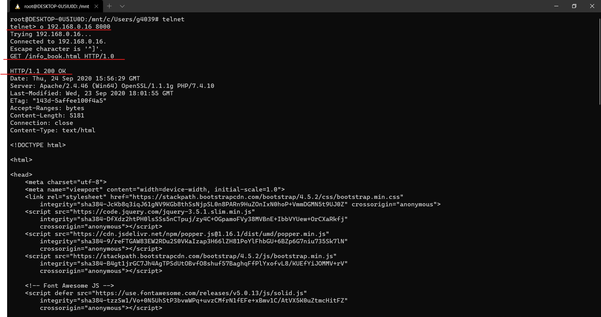
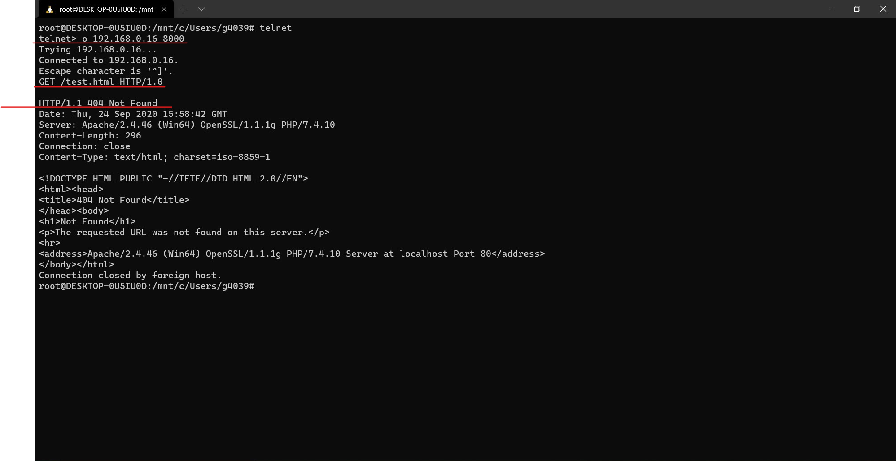
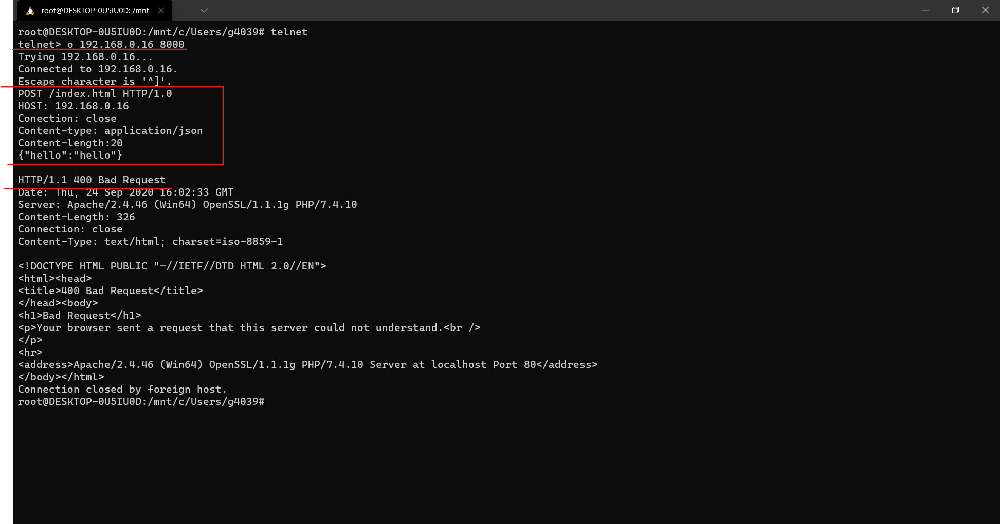

# Лабораторная работа №1

## Use-cases

Ниже приведены основные сценарии использования сайта:

1. При нажатии кнопки "Каталог" на любой из страниц открывается список категорий книг. 
2. При выборе категории "Все книги" в "Каталоге" открывается список всех книг.
3. При выборе книги "Агата Кристи. Десять негритят" открывается подробная информация о книге.
4. При нажатии на надпись "Книжный магазин" открывается главная страница.

## Сетки страниц

### Главная страница

<iframe style="border: 1px solid rgba(0, 0, 0, 0.1);" width="800" height="450" src="https://www.figma.com/embed?embed_host=share&url=https%3A%2F%2Fwww.figma.com%2Ffile%2FW7G5HRGOIMFjztg6a4tz3D%2F%25D0%259A%25D0%25BD%25D0%25B8%25D0%25B6%25D0%25BD%25D1%258B%25D0%25B9-%25D0%25BC%25D0%25B0%25D0%25B3%25D0%25B0%25D0%25B7%25D0%25B8%25D0%25BD%3Fnode-id%3D9%253A7&chrome=DOCUMENTATION" allowfullscreen></iframe>

### Каталог

<iframe style="border: 1px solid rgba(0, 0, 0, 0.1);" width="800" height="450" src="https://www.figma.com/embed?embed_host=share&url=https%3A%2F%2Fwww.figma.com%2Ffile%2FW7G5HRGOIMFjztg6a4tz3D%2F%25D0%259A%25D0%25BD%25D0%25B8%25D0%25B6%25D0%25BD%25D1%258B%25D0%25B9-%25D0%25BC%25D0%25B0%25D0%25B3%25D0%25B0%25D0%25B7%25D0%25B8%25D0%25BD%3Fnode-id%3D0%253A1&chrome=DOCUMENTATION" allowfullscreen></iframe>

### Отдельная страница

<iframe style="border: 1px solid rgba(0, 0, 0, 0.1);" width="800" height="450" src="https://www.figma.com/embed?embed_host=share&url=https%3A%2F%2Fwww.figma.com%2Ffile%2FW7G5HRGOIMFjztg6a4tz3D%2F%25D0%259A%25D0%25BD%25D0%25B8%25D0%25B6%25D0%25BD%25D1%258B%25D0%25B9-%25D0%25BC%25D0%25B0%25D0%25B3%25D0%25B0%25D0%25B7%25D0%25B8%25D0%25BD%3Fnode-id%3D26%253A89&chrome=DOCUMENTATION" allowfullscreen></iframe>

## Сборка страниц на bootstrap

Ознакомиться с результатами верстки можно по [ссылке](src/html/).

## Скриншоты страниц в браузере

<video autoplay muted  loop width="800" height="450" src = "videos/1.mp4"></video>
  
## Скриншоты работы в telnet

### Заголовки каждой страницы через HEAD

### Содержимое каждой страницы через GET

### Заголовок и содержимое несуществующей страницы

### Отправка POST-запроса на главную страницу

