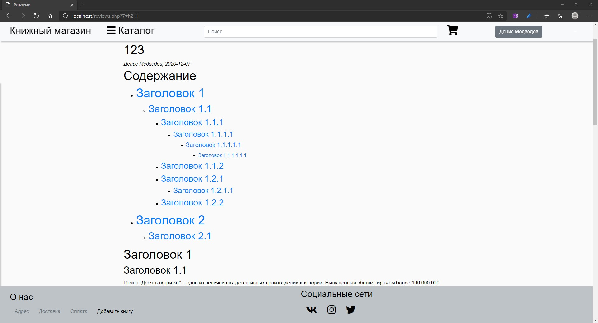

# Лабораторная работа №3

## Формулировка задачи с описанием “как будем делать”

> На вход вашей функции передается html-текст. Верните автоматически построенное оглавление со ссылками на заголовки якоря (тег a). Продемонстрировать на странице сайта, сделанного  на 1-2 ЛР.

### Формулировка задачи

> По выбранной рецензии строится содержание на основе заголовков от h1 до h6 с учетом иерархии.

#### Файл *parser.php*

В файле *parser.php* содержится функция *extractHeaders*, которая выполняет извлечение элементов с тегами **h1,..., h6** из содержимого html-страницы, сохраняя их последовательность в тексте. Последовательность действий следующая:

1. Загружаем содержимое html-страницы (аргумент функции) в экземпляр класса *DOMDocument*.
2. Функцией *getElementsByTagName* извлекаем все элементы.
3. Далее в цикле по выбранным элементам проверяем что выбранный элемент относиться к тегам h1,...,h6. После этого забираем id и сам элемент, и заносим в ассоциативный массив.
4. После завершения цикла возвращаем получившийся ассоциативный массив, где ключ - id, значение - элемент с тегом h.


#### Файл *toc_generator.php*

Файл *toc_generator.php* содержит две функции: set_id и toc_generator.

Функция **set_id** добавляет ко всем **h1,..., h6** уникальный id.
Последовательность действий следующая:
1. С помощью функции getElementsByTagName() получаем все заголовки, соответствующие тегам h1, h2, h3, h4, h5, h6.
2. С помощью функции setAttribute('id', 'h' . $i . '_' . $j) присваиваем заголовкам атрибут id. id имеет вид **h**i_j, где i - это уровень тега, а j - уникальный номер заголовка для тега **h**i.

Функция **generate_toc** строит содержание рецензии по всем найденным заголовкам h1,...,h6 с добавленными якорями.
Последовательность действий следующая:
1. Перебираем в цикле все извлеченные теги **h1,..., h6** по порядку.
2. Извлекаем число, соответствующее уровню тега (например, для h1 это число 1). Также, на каждом проходе цикле запоминается предыдущий уровень.
3. Если следующий уровень больше предыдущего, открываем список ul и вставляем тег h как элемент списка.
4. Если следующий уровень равен предущему, просто вставляем тег h как элемент списка.
5. Если следующий уровень меньше предыдущего, закрываем количество уровней, равное разности между предыдущим и следующим, а затем открываем новый список ul и вставляем тег h как элемент списка.

## Тестовый пример со скриншотом



## PHP-Код, вставленный прямо в протокол

*parser.php*

```php
<?php

function extractHeaders($htmlContent)
{
    $htmlContent = mb_convert_encoding($htmlContent, 'HTML-ENTITIES', "UTF-8");

    $htmlDom = new DOMDocument;
    @$htmlDom->loadHTML($htmlContent);

    $extractedHeaders = array();

    $elements = $htmlDom->getElementsByTagName('*');

    $h_array = array('h1', 'h2', 'h3', 'h4', 'h5', 'h6');

    foreach ($elements as $element) {
        if (in_array($element->tagName, $h_array)) {

            $header_id = $element->getAttribute('id');
            $header_text = $element->nodeValue;

            if (strlen($header_id) > 0 && strlen($header_text) > 0)
            {
                $element->removeAttribute('id');
                $extractedHeaders[$header_id] = $htmlDom->saveHtml($element);
            }
                
        }
    }

    return $extractedHeaders;
}


```

*toc_generator.php*

```php

function set_id($text)
{
    $htmlContent = mb_convert_encoding($text, 'HTML-ENTITIES', "UTF-8");

    $htmlDom = new DOMDocument;
    @$htmlDom->loadHTML($htmlContent);

    $extractedHeaders = array();

    for ($i = 1; $i < 7; $i++) {

        $headers = $htmlDom->getElementsByTagName('h' . $i);
        $j = 0;
        foreach ($headers as $header) {

            $header->setAttribute('id', 'h' . $i . '_' . $j);
            $j++;
        }
    }
    $text = $htmlDom->saveHTML();

    return $text;
}

function add_item($key, $value)
{
    $a = "<a class='btn-link'  href = '#" . $key . "'>" . $value . "</a>";
    echo "<li>" . $a . "</li>";
}

function generate_toc($html)
{
    $links =  extractHeaders($html);
    $keys = array_keys($links);
    echo "<h1>Содержание</h1>";
    $p = 0;
    for ($i = 0; $i < count($keys); $i++) {
        $I = intval(substr(explode("_", $keys[$i])[0], 1));
        if ($I > $p) {
            echo "<ul>";
            add_item($keys[$i], $links[$keys[$i]]);
        }

        if ($I == $p) {
            add_item($keys[$i], $links[$keys[$i]]);
        }

        if ($I < $p) {
            for ($j = 0; $j <=  ($p - $I); $j++) {
                echo "</ul>";
            }
            echo "<ul>";
            add_item($keys[$i], $links[$keys[$i]]);
        }

        $p = $I;
    }
}
```

## Работающее решение в виде папки с файлами

* [Ссылка на репозиторий](https://github.com/book-e-shop/book-e-shop/tree/297c125aba41d9a5fc465d7508960a63f9562f2f)

* [Ссылка на дамп базы](https://github.com/book-e-shop/book-e-shop/blob/master/book_shop%20%D0%9B%D0%A0%203.sql)

## Скринкаст работы решения

<video  muted control width="800" height="450" src = "videos/lab3/1.mp4"></video>
