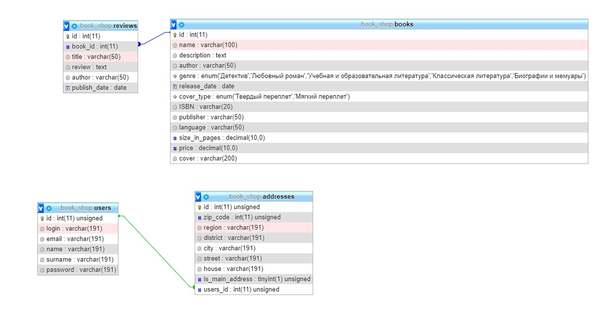

# Лабораторная работа №4

[Ссылка на github (дамп базы там же)](https://github.com/book-e-shop/book-e-shop)

## ТЗ 

### Структура данных

### Все модульные сетки

#### Главная страница

<iframe style="border: 1px solid rgba(0, 0, 0, 0.1);" width="800" height="450" src="https://www.figma.com/embed?embed_host=share&url=https%3A%2F%2Fwww.figma.com%2Ffile%2FW7G5HRGOIMFjztg6a4tz3D%2F%25D0%259A%25D0%25BD%25D0%25B8%25D0%25B6%25D0%25BD%25D1%258B%25D0%25B9-%25D0%25BC%25D0%25B0%25D0%25B3%25D0%25B0%25D0%25B7%25D0%25B8%25D0%25BD%3Fnode-id%3D9%253A7&chrome=DOCUMENTATION" allowfullscreen></iframe>

#### Каталог

<iframe style="border: 1px solid rgba(0, 0, 0, 0.1);" width="800" height="450" src="https://www.figma.com/embed?embed_host=share&url=https%3A%2F%2Fwww.figma.com%2Ffile%2FW7G5HRGOIMFjztg6a4tz3D%2F%25D0%259A%25D0%25BD%25D0%25B8%25D0%25B6%25D0%25BD%25D1%258B%25D0%25B9-%25D0%25BC%25D0%25B0%25D0%25B3%25D0%25B0%25D0%25B7%25D0%25B8%25D0%25BD%3Fnode-id%3D0%253A1&chrome=DOCUMENTATION" allowfullscreen></iframe>

#### Страница отдельной книги 

<iframe style="border: 1px solid rgba(0, 0, 0, 0.1);" width="800" height="450" src="https://www.figma.com/embed?embed_host=share&url=https%3A%2F%2Fwww.figma.com%2Ffile%2FW7G5HRGOIMFjztg6a4tz3D%2F%25D0%259A%25D0%25BD%25D0%25B8%25D0%25B6%25D0%25BD%25D1%258B%25D0%25B9-%25D0%25BC%25D0%25B0%25D0%25B3%25D0%25B0%25D0%25B7%25D0%25B8%25D0%25BD%3Fnode-id%3D26%253A89&chrome=DOCUMENTATION" allowfullscreen></iframe>

#### Добавление книг

<iframe style="border: 1px solid rgba(0, 0, 0, 0.1);" width="800" height="450" src="https://www.figma.com/embed?embed_host=share&url=https%3A%2F%2Fwww.figma.com%2Ffile%2FW7G5HRGOIMFjztg6a4tz3D%2F%25D0%259A%25D0%25BD%25D0%25B8%25D0%25B6%25D0%25BD%25D1%258B%25D0%25B9-%25D0%25BC%25D0%25B0%25D0%25B3%25D0%25B0%25D0%25B7%25D0%25B8%25D0%25BD%3Fnode-id%3D276%253A0" allowfullscreen></iframe>

#### Добавление рецензий

<iframe style="border: 1px solid rgba(0, 0, 0, 0.1);" width="800" height="450" src="https://www.figma.com/embed?embed_host=share&url=https%3A%2F%2Fwww.figma.com%2Ffile%2FW7G5HRGOIMFjztg6a4tz3D%2F%25D0%259A%25D0%25BD%25D0%25B8%25D0%25B6%25D0%25BD%25D1%258B%25D0%25B9-%25D0%25BC%25D0%25B0%25D0%25B3%25D0%25B0%25D0%25B7%25D0%25B8%25D0%25BD%3Fnode-id%3D275%253A166" allowfullscreen></iframe>

### Сценарии работы

В базе были созданы 2 таблицы: книги и рецензии. 

Ниже приведены сценарии добавления новой книги в таблицу, а также просмотр книг:

> 1. По нажатию на кнопки Добавить книгу (кнопка временно располагается в подвале сайта) открывается форма добавления книги в базу данных. 
> 2. После заполнения всех полей корректными данными (присутствует валидация) необходимо нажать на кнопку добавить, чтобы книга попала в базу. В случае успешного добавления в верхей части страницы всплывет сообщение.
> 3. Отображение добавленных в базу книг осуществляется на следующих страницах: 
> * На главной странице. Все книги выбираются из базы.
> * В жанрах (они также формируются на основе базы). Открыв вкладку "Каталог" можно выбрать жанр книги, по нажатию на который будет сделана выборка из базы книг, соответствующих жанру.
> * На странице отдельной книги. При нажатии на отдельную книги открывается новая страница с подробной информацией о книге.

Ниже приведены сценарии добавления новой резензии в таблицу, а также просмотр рецензии:

> 1. На странице с подробной информацией о книге (в которую можно попасть, нажав на отдельную книгу) необходимо нажать кнопку Добавить резенацию.
> 2. После нажатия кнопки открывается форма. После заполнения формы нужно нажать на кнопку Добавить, после чего будет рецензию будет добавлена в таблицу базы данных, а также появится снизу подробной информации о книге.
> 3. Просмотр рецензии осуществляется на той же странице с подробной информацией о книге. Необходимо нажать на название добавленной рецензии ниже подробной информации о книге.
> 4. Ввод рецензии осуществляется с помощью языка разметки **Markdown**. В этом формате она хранится в БД. Для показа рецензии используется библиотека [**Parsedown**](https://github.com/erusev/parsedown), которая преобразует Markdown разметку в HTML.

## Безопасность

При добавлении новой книги и рецензии используется валидации полей:
* Проверяется минимальное и максимальное количество введенных символов. 
* Для проверки кода ISBN выполняется проверка с помощью регулярных выражений.

## Скринкаст

### Добавление книги

<video  muted   width="800" height="450" src = "videos/lab4/1.mp4"></video>

### Добавление рецензии

<video  muted   width="800" height="450" src = "videos/lab4/2.mp4"></video>
  
