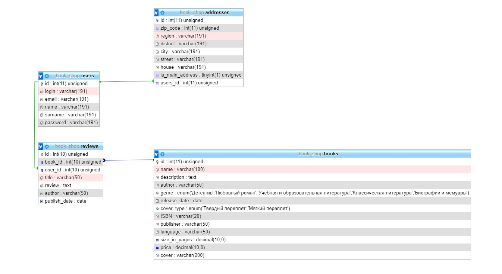

# Лабораторная работа 6. Собственная регистрация, поиск, авторизация через таблицу users, внешняя авторизация, внешняя интеграция.

[Ссылка на github (дамп базы там же)](https://github.com/book-e-shop/book-e-shop/tree/53692611483e1467218d63ab81dd8dd28bddb040)

## [Структура данных](https://github.com/book-e-shop/book-e-shop.github.io/blob/master/img/lab5/db.png)




## Модульные сетки

#### Главная страница

<iframe style="border: 1px solid rgba(0, 0, 0, 0.1);" width="800" height="450" src="https://www.figma.com/embed?embed_host=share&url=https%3A%2F%2Fwww.figma.com%2Ffile%2FW7G5HRGOIMFjztg6a4tz3D%2F%25D0%259A%25D0%25BD%25D0%25B8%25D0%25B6%25D0%25BD%25D1%258B%25D0%25B9-%25D0%25BC%25D0%25B0%25D0%25B3%25D0%25B0%25D0%25B7%25D0%25B8%25D0%25BD%3Fnode-id%3D9%253A7&chrome=DOCUMENTATION" allowfullscreen></iframe>

#### Каталог

<iframe style="border: 1px solid rgba(0, 0, 0, 0.1);" width="800" height="450" src="https://www.figma.com/embed?embed_host=share&url=https%3A%2F%2Fwww.figma.com%2Ffile%2FW7G5HRGOIMFjztg6a4tz3D%2F%25D0%259A%25D0%25BD%25D0%25B8%25D0%25B6%25D0%25BD%25D1%258B%25D0%25B9-%25D0%25BC%25D0%25B0%25D0%25B3%25D0%25B0%25D0%25B7%25D0%25B8%25D0%25BD%3Fnode-id%3D0%253A1&chrome=DOCUMENTATION" allowfullscreen></iframe>

#### Страница отдельной книги 

<iframe style="border: 1px solid rgba(0, 0, 0, 0.1);" width="800" height="450" src="https://www.figma.com/embed?embed_host=share&url=https%3A%2F%2Fwww.figma.com%2Ffile%2FW7G5HRGOIMFjztg6a4tz3D%2F%25D0%259A%25D0%25BD%25D0%25B8%25D0%25B6%25D0%25BD%25D1%258B%25D0%25B9-%25D0%25BC%25D0%25B0%25D0%25B3%25D0%25B0%25D0%25B7%25D0%25B8%25D0%25BD%3Fnode-id%3D26%253A89&chrome=DOCUMENTATION" allowfullscreen></iframe>

#### Добавление и редактирование книг

<iframe style="border: 1px solid rgba(0, 0, 0, 0.1);" width="800" height="450" src="https://www.figma.com/embed?embed_host=share&url=https%3A%2F%2Fwww.figma.com%2Ffile%2FW7G5HRGOIMFjztg6a4tz3D%2F%25D0%259A%25D0%25BD%25D0%25B8%25D0%25B6%25D0%25BD%25D1%258B%25D0%25B9-%25D0%25BC%25D0%25B0%25D0%25B3%25D0%25B0%25D0%25B7%25D0%25B8%25D0%25BD%3Fnode-id%3D276%253A0" allowfullscreen></iframe>

#### Добавление и редактирование рецензий

<iframe style="border: 1px solid rgba(0, 0, 0, 0.1);" width="800" height="450" src="https://www.figma.com/embed?embed_host=share&url=https%3A%2F%2Fwww.figma.com%2Ffile%2FW7G5HRGOIMFjztg6a4tz3D%2F%25D0%259A%25D0%25BD%25D0%25B8%25D0%25B6%25D0%25BD%25D1%258B%25D0%25B9-%25D0%25BC%25D0%25B0%25D0%25B3%25D0%25B0%25D0%25B7%25D0%25B8%25D0%25BD%3Fnode-id%3D275%253A166" allowfullscreen></iframe>

## Сценарии работы и представления

#### Сценарии работы с поиском

1. В поле поиска вводится текст (поиск осуществляется для текста больше трех символов).
2. Далее выполняется запрос к базе данных (к таблице **books**), после чего выдаются результаты поиска в виде списка книг (поиск осуществляется по полям **name**, **description**).
3. При нажатии на одну из книг, выданных в результате, открывается отдельная страница книги с подробной информацией о ней.

#### Полнотекстовый индекс

В базе данных в таблице **books** были созданы индексы **ft_name_desc, ft_name** типа FULLTEXT. Результаты поиска возвращаются следующим образом:

```sql

SELECT `books`.*, MATCH (`name`) AGAINST ('$search') AS name_score, MATCH (`name`, `description`) AGAINST ('$search') AS score 
        FROM `books` WHERE MATCH (`name`, `description`) AGAINST ('$search*' IN BOOLEAN MODE)
        ORDER BY name_score DESC, score DESC;

```
, где **$search** - искомый текст. Функция MATCH() выполняет поиск в естественном языке, сравнивая строку с содержимым текста (совокупность одного или более столбцов, включенных в индекс FULLTEXT). Строка поиска задается как аргумент в выражении AGAINST(). Поиск выполняется без учета регистра символов.

#### Ajax

JS скрипт **ajax_search.js** получает введенный в поле текст и отправляет его POST-запросом на обработчик **ajax_search.php**, ответ выводится в всплывающем списке книг. Поиск осуществляется в реальном времени, т.е. результаты отображаются при вводе. Для этого используется событие "keyup" (нажатая клавиша была отпущена).

#### Сортировка результатов по релевантности

Результаты поиска сортируются в порядке убывания по величине релевантности, т.е. по степени сходства между строкой поиска и текстом. Это происходит благодаря применению MATCH() несколько раз. Также, применяется поиск в логическом режиме с использованием модификатора IN BOOLEAN MODE с целью поиска результатов по части слова.

#### Скринкаст работы поиска
<video  muted controls  width="800" height="450" src = "videos/lab6/search.mp4"></video>

### Интеграция с внешним сервисом Яндекс.Спеллер  

> Яндекс.Спеллер помогает находить и исправлять орфографические ошибки в русском, украинском или английском тексте. Языковые модели Спеллера включают сотни миллионов слов и словосочетаний.

Сценарии работы с Яндекс.Спеллер
1. При добавлении рецензии пользователь может нажать .
2. При нажатии на кнопку "Проверить ошибки" выполняется Ajax-запрос к файлу **speller.php**.
3. Скрипт **speller.php** выполняет post-запрос к методу [checkText](https://yandex.ru/dev/speller/doc/dg/reference/checkText.html/), используя **JSON** интерфейс.
В теле запроса передается текст, введенный пользователем и полученный через Ajax.
4. Полученный ответ отправляется клиенту, где с помощью библиотеки [Mark.js](https://markjs.io/) происходит подсветка найденных ошибок.

#### Скринкаст работы c Яндекс.Спеллер 
<video  muted controls  width="800" height="450" src = "videos/lab6/speller.mp4"></video>

### Интеграция с внешним сервисом Google Книги  

Сценарии работы с Google Книги
1. Используя [Google Books APIs](https://www.google.com/books/jsapi.js) выводится фрагмент книги. Поиск осуществляется по ISBN. Для отображения фрагмента используется Embedded Viewer API.
2. Если книга с заданным ISBN отсутствует в библиотеке Google Книг, то выводится сообщение "Фрагмент не найден".

```js
<script type="text/javascript" src="https://www.google.com/books/jsapi.js"></script>
<script type="text/javascript">
        google.books.load();

        function alertInitialized() {
            $("#viewerCanvas").html("<h4>Фрагмент не найден</h4>")
            $("#viewerCanvas").height(10);

        }

        function initialize() {
            var viewer = new google.books.DefaultViewer(document.getElementById('viewerCanvas'));
            viewer.load("<?php echo "ISBN:" . str_replace("-", "", $book['ISBN']); ?>", alertInitialized);
        }

        google.books.setOnLoadCallback(initialize);
</script>
<div id="viewerCanvas" style="width: 100%; height: 50vh;text-align: center;"></div>
```
#### Скринкаст работы c Google Книги  
<video  muted controls  width="800" height="450" src = "videos/lab6/gbook.mp4"></video>

### Регистрация вручную
В таблице **users** хранятся: логин, хеш пароля и дополнительная информация (ФИО, email,...).
Перед выполнением авторизации/регистрации пользователь проходит CAPTCHA.

Сценарии работы с CAPTCHA
1. CAPTCHA генерируется с помощью скрипта **getCaptcha.php**.
2. Выбирается случайная подстрока из заданного набора символов. Эти символы хэшируются и добавляются в сессию.
3. Далее полученная подстрока преобразуется в изображение с помощью функции  **imagettftext**.
4. Получение капчи происходит с помощью ajax запроса. Перед передачей клиенту, изображение кодируется с помощью base64.
5. Скрипт **verifyCaptcha.php** выполняет сравнение введенного кода с кодом, сохраненном в сессии.


Сценарии работы с регистрацией
1. После успешного прохождения CAPTCHA пользователь заполняет регистрационную форму.
2. Далее, с помощью ajax-запроса, данные формы отправляются в файл **signup.php**.
3. Скрипт **signup.php** проверяет введенные данные на наличие ошибок и в случае их отсутствия добавляет пользователя в БД.

#### Скринкаст работы c CAPTCHA и регистрацией  
<video  muted controls  width="800" height="450" src = "videos/lab6/signup.mp4"></video>

Сценарии работы с авторизацией
1. После успешного прохождения CAPTCHA пользователь заполняет форму с логином и паролем.
2. Далее, с помощью ajax-запроса, эти данные передаются в файл **signin.php**.
3. Скрипт **signin.php** проверяет введенные данные на наличие ошибок и в случае их отсутствия выполняется авторизация.

#### Скринкаст работы c CAPTCHA и авторизацией  
<video  muted controls  width="800" height="450" src = "videos/lab6/signin.mp4"></video>

